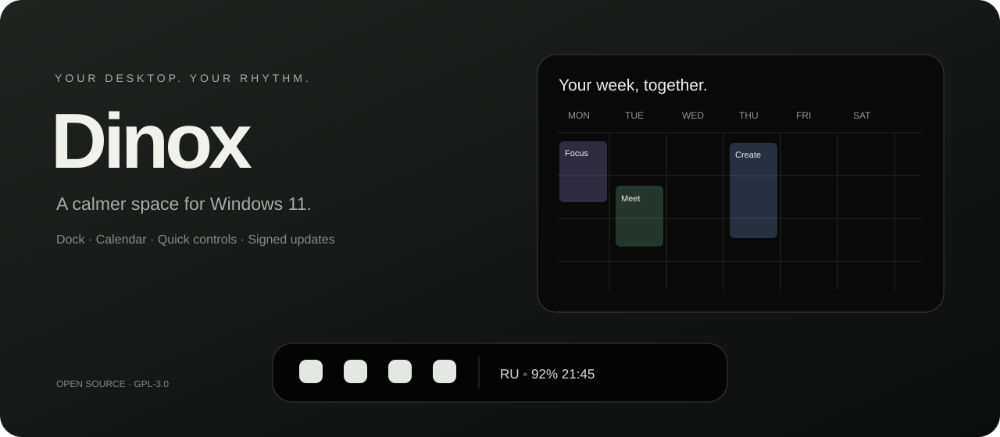

<h1 align="center">Dinox Desktop</h1>

A quieter Windows desktop. Your dock, calendar and daily controls, together.

English · <a href="README.ru.md">Русский</a>

 

<a href="https://github.com/JapanDino/Dinox-Desktop/releases/latest">Download for Windows</a> · <a href="docs/DEVELOPMENT.md">Build from source</a> · <a href="docs/UPDATES.md">Updates</a> · <a href="https://github.com/JapanDino/Dinox-Desktop/issues">Report a problem</a>

Dinox is a community Windows desktop customization app, built with Rust, Tauri and React. It continues the Bloom Personal fork with its own identity and signed release channel. The illustration above is an interface concept; device information and calendars depend on your computer and configuration.

| Make it yours | What is included |
| --- | --- |
| Dock | Pinned and running apps, appearance controls, Windows pin import and attention animations |
| Island | Time, optional date and indicators, media controls, hover visibility and calendar access |
| Calendar | Month, week and agenda views; read-only ICS subscriptions, including Google and Yandex calendar feeds |
| Quick controls | Wi-Fi and Bluetooth panels, sound, brightness, battery, keyboard layout and tray access |
| Search | Floating launcher, custom keyboard shortcut, apps, Windows-indexed files, calculator and web search |
| Audio mixer | Per-app volume and mute, output-device selection and volume |
| Layout editor | Island and dock preview, rearrange indicators, save or cancel changes |
| Notifications | Optional Windows notification integration, messenger-style cards and privacy controls |
| Preferences | Russian and English UI, coordinated themes and performance settings |

## Getting started

Download the x64 installer from **Releases**, install for your Windows account, then open Settings. Start with the default layout; enable taskbar replacement and notification integration only when you want them. **Ctrl+Alt+B** restores the Windows taskbar. The recovery guardian also attempts restoration if Dinox stops unexpectedly.

Windows 11 x64 is the primary target. WebView2 is required; the installer can obtain it. This is an early community release: compatibility with every display, driver, shell extension or Windows build is not guaranteed.

## What to expect

Configure the search shortcut in **Settings → General → Dinox search**. If another app owns the shortcut, Dinox reports the conflict; choose another combination or free it in that app and retry. See the [desktop tools guide](docs/DESKTOP-TOOLS.md).

- Calendar feeds are **read-only**, refreshed on the configured interval; they do not edit Google or Yandex events. Treat private ICS links like passwords.
- Wi-Fi enumeration may require Windows location permission. Bluetooth behavior depends on the adapter and device.
- Capturing other apps' notifications requires a Windows package identity and notification access. A fresh EXE installation alone does not grant this. Existing Bloom Personal notification registration is preserved; no certificate is silently trusted by the installer.
- Telegram must publish notifications through Windows for the listener to receive them. Dinox cannot capture Telegram's independent custom popup channel or promise every notification contains an avatar.
- Some Windows-owned surfaces still use system fallbacks. Dinox does not replace Explorer itself.
- CPU and battery costs vary by settings and hardware. There are no representative measured battery-life claims yet. See [performance](docs/PERFORMANCE.md).

## Updates

Dinox checks at startup and every six hours. **Installation is offered by default.** Optional automatic installation runs at the next startup, when a newer release is available. Packages must pass the embedded public-key signature check. A source-code push runs checks; a version tag publishes a release. See the [release guide](docs/UPDATES.md).

## Development and provenance

See [development](docs/DEVELOPMENT.md), [settings](SETTINGS.md), [security](SECURITY.md) and [contributing](CONTRIBUTING.md). Built by **JapanDino**, based on **Bloom by sehaz**. Original licensing and attribution are retained; see [UPSTREAM.md](UPSTREAM.md) and [GPL-3.0](LICENSE).

This repository is independent of the separate `JapanDino/Dinox` calendar project.
