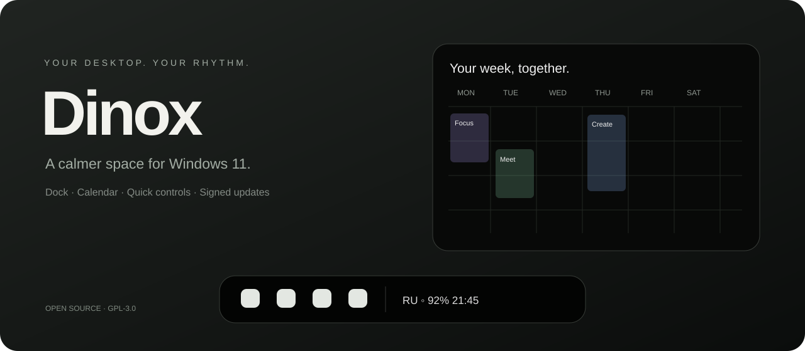

<h1 align="center">Dinox Desktop</h1>

Док, календарь и повседневные настройки Windows в едином интерфейсе.

<a href="https://github.com/JapanDino/Dinox-Desktop/releases/latest">Скачать для Windows</a> · <a href="README.md">English</a> · <a href="https://github.com/JapanDino/Dinox-Desktop/issues">Сообщить об ошибке</a>

Dinox — независимое продолжение Bloom Personal на Rust, Tauri и React. Основная платформа — **Windows 11 x64**. Это ранняя публичная версия: работа всех устройств и всех конфигураций Windows пока не подтверждена.

## Возможности

- Настраиваемый док: свои закрепления, импорт доступных ярлыков Windows, запущенные приложения и анимация привлечения внимания.
- Верхний остров: часы, дата и индикаторы по выбору, управление музыкой и появление при наведении.
- Календарь: месяц, неделя, повестка и подписки по ICS, включая Google и Яндекс.
- Панели Wi-Fi и Bluetooth, звук, яркость, батарея, раскладка и доступ к значкам трея.
- Опциональные уведомления Windows с карточками в стиле мессенджеров.
- Русский и английский интерфейс, единое оформление и настройки производительности.
- Быстрый поиск приложений, файлов из индекса Windows, калькулятор и поиск в интернете. Свой хоткей: **Настройки → Основные → Поиск Dinox**. Занятые сочетания отмечаются; настройки других программ автоматически не меняются.
- Микшер громкости отдельных приложений и выбор устройства вывода звука.
- Редактор острова и дока с предпросмотром, сохранением и отменой изменений.
- Многодневные события отдельными полосами над сеткой недели; переключение месяцев колесом без прокрутки всей панели.

Подробнее — в [руководстве по инструментам рабочего стола](docs/DESKTOP-TOOLS.md).

- Виджеты поверх окон по хоткею: задачи, проекты, фокус-таймер и заметки с форматированием.
- Google Calendar/Tasks: вход через браузер, создание событий и задач, отметка выполнения. Непроверенный бесплатный пилот до 100 пользователей.
- Экспериментальный локальный Telegram-прокси; выключен по умолчанию. Подробнее: [подключение и ограничения](docs/TELEGRAM-PROXY.md).

[Сайт Dinox](https://japandino.github.io/Dinox-Desktop/) · [Google-пилот](docs/GOOGLE-PILOT.md) · [Виджеты](docs/WIDGETS.md) · [Заметки](docs/STICKY-NOTES.md)

## Установка и ограничения

Скачай установщик из Releases. Настрой внешний вид и закрепления; затем при необходимости включи замещение панели Windows. **Ctrl+Alt+B возвращает обычную панель задач.** При аварийном завершении восстановление также выполняет отдельный процесс.

ICS-подписки работают только на чтение с выбранным интервалом. Подключение Google позволяет создавать события и задачи и отмечать выполнение задач; редактирования и удаления событий в интерфейсе пока нет. Google Tasks поддерживает дату без точного времени. Запись в Яндекс не включена. Приватной ICS-ссылкой нельзя делиться публично.

Для чтения чужих уведомлений Windows требует зарегистрированный пакет и разрешение. Обычный EXE-установщик сам по себе их не предоставляет и не добавляет доверенные сертификаты. Существующее подключение Bloom Personal сохраняется. Telegram должен отправлять уведомления через Windows: собственные всплывающие окна Telegram недоступны этому механизму. Фото контакта отображается только когда источник его предоставляет.

Wi-Fi может потребовать разрешение Windows на геолокацию. Некоторые функции используют системные панели. Фиксированных обещаний по расходу батареи пока нет: см. [методику измерения](docs/PERFORMANCE.md).

## Обновления

По умолчанию Dinox **предлагает** установку. Если включить автообновление в разделе «О программе», новая версия установится при следующем запуске с перезапуском приложения. Во время работы проверка выполняется раз в шесть часов без автоматической установки.

Обновления скачиваются из этого репозитория и проверяются криптографической подписью. Неверная подпись блокирует установку. Подпись обновлений не равна сертификату издателя Windows.

Для выпуска новой версии: изменить код, выполнить `bun run bump X.Y.Z` с нужным следующим номером, обновить описание релиза, проверить и закоммитить изменения, отправить `main`, затем тег `vX.Y.Z`. GitHub Actions соберёт и опубликует установщик. Обычный push исходников не обновляет установленное приложение. Подробности — в [руководстве по релизам](docs/UPDATES.md).

## Исходники

[Сборка](docs/DEVELOPMENT.md) · [Настройки](SETTINGS.md) · [Безопасность](SECURITY.md) · [Участие в разработке](CONTRIBUTING.md).

Автор доработок — **JapanDino**. Основа — **Bloom от sehaz**, с сохранённой лицензией [GPL-3.0](LICENSE) и [указанием происхождения](UPSTREAM.md). Этот проект не связан с отдельным репозиторием `JapanDino/Dinox`.
